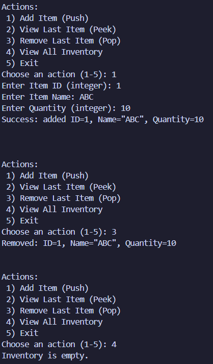
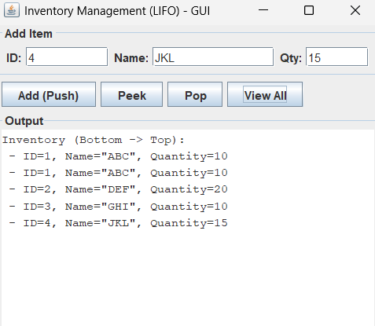
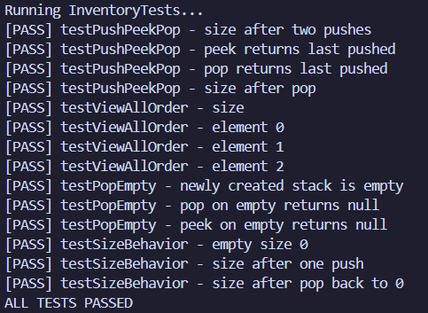

# Inventory Management System (LIFO) 

A small, self-contained inventory manager that demonstrates Last-In, First-Out (LIFO) behavior using a Stack implemented with Java's collection classes. This repository contains:

- A command-line interface (CLI) that accepts user input interactively.
- A simple Swing-based GUI (separate module) to exercise the same functionality.
- A tiny programmatic test harness demonstrating expected behavior.

----

Quick start (PowerShell)
------------------------
Prerequisites: JDK 8+ installed and `javac`/`java` available in PATH. Java 11+ is recommended.

Open PowerShell and run from the project root (where this README sits):

Compile main sources and run the CLI (scripted example):

```powershell
cd "C:\Users\SAKETH\Documents\Project\Inventory Management System"
javac -d bin src\main\java\*.java; Get-Content test_input.txt -Raw | java -cp bin Main
```

Compile and run programmatic tests:

```powershell
javac -d bin src\main\java\*.java src\test\java\*.java; java -cp bin InventoryTests
```

Compile and run the Swing GUI:

```powershell
javac -d bin src\main\java\*.java src\gui\java\*.java; java -cp bin InventoryGUI
```

Or use the included helper scripts:

- `.
un_test.ps1` - compiles main & test sources and runs `InventoryTests`.
- `.
un_gui.ps1` - compiles main & GUI sources and runs the GUI.

----

Project layout
--------------

Top-level files:

- `test_input.txt` - sample inputs used by the scripted CLI run.
- `run_test.ps1`, `run_gui.ps1` - small PowerShell helpers.
- `README.md`, `TESTS.md` - documentation and test notes.

Java sources:

- `src/main/java/` - main application code
  - `InventoryItem.java` - model (id, name, quantity)
  - `InventoryStack.java` - stack (push/pop/peek/getAll/isEmpty/size)
  - `Main.java` - interactive CLI

- `src/test/java/` - programmatic test harness
  - `InventoryTests.java` - in-repo tests (prints PASS/FAIL)

- `src/gui/java/` - small GUI module
  - `InventoryGUI.java` - Swing UI wiring to the same core classes

Design notes
------------

- The core logic (model + stack) lives in `src/main/java` and is UI-agnostic.
- The CLI and GUI both use the same `InventoryStack` so behavior is consistent.
- Storage is in-memory only (no persistence). The simple design is intended for learning and extension.

Examples
--------

Scripted CLI (contents of `test_input.txt`):

- Add ID=1 Name=Box A Qty=10
- Add ID=2 Name=Box B Qty=5
- Peek (shows Box B)
- Pop (removes Box B)
- View All (shows only Box A)

When run, the CLI prints confirmations and list output like:

```
Success: added ID=1, Name="Box A", Quantity=10
Success: added ID=2, Name="Box B", Quantity=5
Top item: ID=2, Name="Box B", Quantity=5
Removed: ID=2, Name="Box B", Quantity=5
Inventory (Bottom -> Top):
 - ID=1, Name="Box A", Quantity=10
```

Screenshots
-----------



Scripted CLI demonstrating LIFO behavior (Add, Peek, Pop, View All).



Swing GUI showing input fields and Output area.



Programmatic test output showing PASS/FAIL.

Testing
-------

`InventoryTests.java` is intentionally small and dependency-free - it prints PASS/FAIL per check and exits with code 0 when all tests pass. Use the `run_test.ps1` helper or the PowerShell compile command above.

Next steps / ideas
------------------

- Convert `InventoryTests` to JUnit and add a `build.gradle` so you can run tests with a standard Java build tool.
- Add persistence (JSON or CSV) so inventory survives restarts; expose load/save from both CLI and GUI.
- Add duplicate-ID handling (reject, merge quantities, or update existing item).
- Replace Swing with JavaFX for a fresher UI (requires JavaFX libs on newer JDKs).

